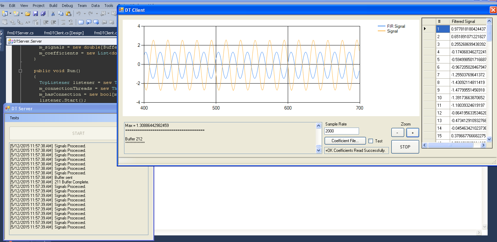
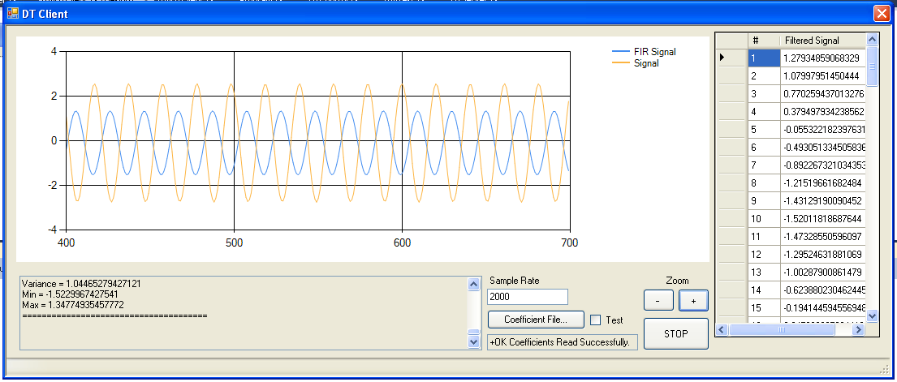

# DT9816 Real-time Signal Capture

This was a project for an embedded course I took at Univerity of Texas-Arlington. The original project was to write a parallel C++ program and capture signals from the DT9816 device on another computer, transfer them over a network, and then have another server program capture and record the information. The vendor (Data Translation, I think) actually had some libraries for .Net to help with using the device so I thought I'd give it a shot and see if it could be done. The result was this neat little app and libraries.

Below are snippets of my final write-up.

## Overview

In our final project, we were asked to create a data acquisition server that could filter and transmit captured signals to a client. The filter we had to use was a [convolution](https://en.wikipedia.org/wiki/Convolution) filter. This essentially filters a signal by using the accumulation of all previous signals as a factor for the current input.

## Basic Steps

I began the solution by designing a basic flow diagram detailing the algorithm for achieving my solution. The diagram is in two parts: Server and Client. The essence of the idea is to:

1. Setup a client/server connection that allows both parties to communicate a basic set of commands to one another. Even though the command set is small, I still had to ensure that each side of communication was synchronized with the other so both parties must agree on a protocol to communicate messages and data back and forth. 

2. Use the Open Layer’s library to communicate with the DT9816, and encapsulate that in a small class that provides only the functionality necessary for our acquisition: Continuous Analog Input and Digital Output.

3. Use parallel libraries to implement a convolution algorithm that filters the signals acquired from the device using a user-selected set of coefficients. **You can also check out my [post](http://brutalsimplicity.github.io/2016/05/23/mandelbrot.html) about writing parallel code in C#**

4. The client then issues the start command to the server and waits to receive buffers of data until the user is ready to stop.

5. Server acquires and filters the data and then sends the data packets to the client until receiving the stop command, or the signal-processing switch is deasserted.

## Design

### Server Execution Flow Diagram

The below diagram shows server's execution flow. It's main tasks are to startup, wait for connections, once a connection is established begin the data transimission protocol, and once the client signals (by the START command), begin capturing, filtering, and transmitting the data back.

### Client Execution Flow Diagram

This shows the basic paths of execution on the client. I didn't include some of the additional funcionality (such as zoom in/out of signals, displaying signals in a grid, etc...) as that was not apart of the requirements. I just added it for fun!

### Communication Protocol Diagram

This shows the sequencing of the messages sent back and forth between the client/server. Interestingly, this is probably where the bulk of my project work fell. I wanted a protocol that was comprehensive enough to do more than just send/receive signals. I wanted it to be able to use any arbitrary command, so I kind of modeled it after some transmission protocols I was familiar with (tcp/ip for example), but tried to make it simple since I was short on time. Looking back, it probably needed something more robust as the synchronizing would have been difficult if a requirement for servicing multiple connections was required.

### Block Diagram

This shows the basic connections of the DT9816 to its input and output. Not shown here, is a USB cable plugging the device into the computer.

## Tests

### Coefficient Signal Test

My process was to basically build each portion in pieces since I was starting over from a C# implementation which did not have the benefit of an already functional client/server and data acquisition algorithm. The first test I ran was to setup a client/server connection and then use the test coefficients and signals from our assignment to verify functionality of both the data transmission and convolution.

This test used a set of test signals saved on disk, whose correct output should produce a sine wave that cycles between approximately -0.2 and 0.2. This can be verified in the screenshot. It also verified functionality of the client and server, as the simulation was done as if acquiring a real-time signal. For example, the client sent the coefficients and the server then ran the coefficients against the convolution filter and transmitted it back to the client.

### Data Acquisition Test

In this test I wanted to ensure the functionality of the continuous data acquisition. Here I used a small test application that would read digital and analog signals from the device and output a digital value that the user entered.

## Trial By Fire Insights

### Buffer Overflow

One of the biggest issue I had at this phase was that the filtering and transmission of the data could not keep up with acquisition. The DT9816 only allows up 9 buffers for data capture and if you can't remove the buffers before it reaches capacity it ends up throwing a runtime error, which causes the application to crash. This issue was solved by increasing the sample size. It turns out that trying to filter 100 samples at a time is probably not an efficient use of a processor that can execute a billion instructions per second - go figure! When the sample size was increased from 100 to 1000 our issues with buffer overflow were resolved.

### Network Problems

So I already had the issue with the data not being filtered and transmitted fast enough because the sample size was too small, well I had another similar issue once I ran the client and server on two different computers. It also turns out that sending small packet sizes is also not an efficient use of computer (or rather, network) resources, and again, I kept getting runtime errors because the buffers were too small. I resolved this by increasing our packet size from 100 signals to 1000 signals – an entire sample – which ended up working perfectly. Now our device had no issue emptying the buffer and processing the signals.

## Screenshots

Screenshot of a test runnning the server/client on the same computer.

Screenshot of the client receiving data from the server running the convolution filter on a 100 Hz input signal.
